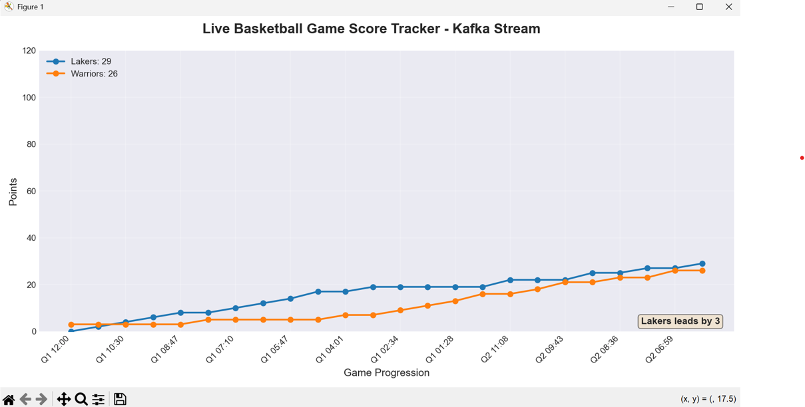

# Basketball Game Score Tracker - Kafka Streaming Analytics

## Overview

This project demonstrates real-time streaming analytics using Apache Kafka to simulate and visualize a live basketball game. The system streams scoring events through Kafka and provides dynamic visualization of the game's progression, showing running scores, point differentials, and momentum shifts between two competing teams.

## Project Focus

**Real-time basketball game simulation** that streams scoring events through Kafka and visualizes the running score, point differential, and momentum shifts between two teams (Lakers vs Warriors) throughout a game.

### Key Insight

The primary insight this pipeline provides is **"Who's winning and by how much?"** in real-time. By processing each scoring event as it arrives, we can:
- Track running scores for both teams
- Calculate point differentials instantly
- Detect momentum shifts (when one team scores 6+ consecutive points)
- Visualize scoring trends throughout the game

This mirrors what you'd see on sports analytics platforms like ESPN or sports betting sites, where live game data drives instant insights and visualizations.

## What Happens with Each Message

When a scoring event arrives from the Kafka topic, the consumer performs the following analytics:

1. **Validates the JSON message** to ensure data integrity (correct fields, valid point values)
2. **Updates running scores** for both home and away teams
3. **Stores the event** in a deque (fixed length of 50) for visualization - this prevents memory issues while maintaining recent history
4. **Tracks consecutive scoring** to detect momentum shifts - alerts when one team scores 6+ straight points
5. **Calculates point differential** and determines which team is leading
6. **Updates the live visualization** with the new data point

**Why this is interesting:** Each message represents a single scoring play (2-point or 3-point basket), and by processing them in real-time, we can see the game unfold exactly as it would in a real broadcast. The momentum detection helps identify critical game moments when one team is "heating up," which is valuable for sports analysts, fans, and potentially betting applications.

## Technologies Used

- **Apache Kafka** - Distributed message streaming platform
- **Python** - Producer and consumer implementation
- **Matplotlib** - Real-time animated data visualization
- **JSON** - Message serialization format
- **Collections.deque** - Efficient FIFO data structure for recent event tracking

## Project Structure

```
buzzline-06-gbogbo/
├── consumers/
│   ├── basketball_consumer.py    # Main consumer with analytics logic
│   └── visualizer.py              # Matplotlib animation handler
├── producers/
│   └── basketball_producer.py    # Simulates and streams game events
├── data/
│   └── game_config.py            # Team rosters and game parameters
├── utils/
│   ├── kafka_config.py           # Kafka connection settings
│   ├── logger_config.py          # Logging configuration
│   ├── message_validator.py     # JSON message validation
│   ├── utils_producer.py         # Producer helper functions
│   └── utils_consumer.py         # Consumer helper functions
└── README.md
```

## Prerequisites

- Python 3.11
- Apache Kafka running locally (default: `localhost:9092`)
- Required Python packages (install via `requirements.txt`)

```bash
pip install -r requirements.txt
```

## Running the Pipeline

### Step 1: Start Kafka

Ensure your Kafka broker is running on `localhost:9092`. The producer will automatically create the topic if it doesn't exist.

### Step 2: Run the Producer

Open a terminal and execute:

```bash
python producers/basketball_producer.py
```

Or using the module syntax:

```bash
python -m producers.basketball_producer
```

**What the producer does:**
- Verifies Kafka is ready
- Creates/resets the `basketball-game` topic
- Simulates a full 4-quarter basketball game
- Generates 8-15 scoring events per quarter
- Streams JSON messages to Kafka with realistic game pacing

**Expected Output:**
```
2025-10-02 21:15:30 | INFO | Basketball Producer Starting...
2025-10-02 21:15:30 | INFO | Kafka broker address: localhost:9092
2025-10-02 21:15:31 | INFO | Topic 'basketball-game' created successfully.
2025-10-02 21:15:31 | INFO | Starting basketball game simulation...
2025-10-02 21:15:31 | INFO | Lakers vs Warriors

=== Quarter 1 ===
2025-10-02 21:15:31 | INFO | Q1 11:45 - Lakers: LeBron James scores 2 points! Score: 2-0
2025-10-02 21:15:33 | INFO | Q1 11:20 - Warriors: Stephen Curry scores 3 points! Score: 2-3
...
```

### Step 3: Run the Consumer

Open a **separate terminal** and execute:

```bash
python consumers/basketball_consumer.py
```

Or using the module syntax:

```bash
python -m consumers.basketball_consumer
```

**What the consumer does:**
- Subscribes to the `basketball-game` Kafka topic
- Validates each incoming JSON message
- Processes scoring analytics (tracks scores, detects momentum)
- Opens a Matplotlib window with live animated visualization
- Updates the chart in real-time as events arrive

**Expected Output:**
```
2025-10-02 21:16:00 | INFO | Basketball Consumer Starting...
2025-10-02 21:16:00 | INFO | Subscribing to topic: basketball-game
2025-10-02 21:16:00 | INFO | Analytics initialized: Lakers vs Warriors
2025-10-02 21:16:01 | INFO | Consumer ready. Waiting for messages...
2025-10-02 21:16:01 | INFO | Starting visualization...
2025-10-02 21:16:02 | INFO | Event #1 | Q1 11:45 | Lakers: LeBron James scores 2 pts | Score: 2-0 | Lakers leads by 2
2025-10-02 21:16:03 | INFO | Event #2 | Q1 11:20 | Warriors: Stephen Curry scores 3 pts | Score: 2-3 | Warriors leads by 1
2025-10-02 21:16:10 | INFO | MOMENTUM SHIFT: Lakers has scored 8 consecutive points!
...
```

## Dynamic Visualization

The consumer automatically opens a **Matplotlib animated line chart** that displays:

### Chart Features:
- **X-axis:** Game time progression (e.g., "Q1 10:00", "Q2 5:30", etc.)
- **Y-axis:** Running total points scored (range: 0-120)
- **Two lines:**
  - **Blue line with circle markers** - Home team (Lakers) score
  - **Orange line with circle markers** - Away team (Warriors) score
- **Legend:** Shows team names with current scores
- **Annotation box:** Displays point differential and which team is leading
- **Real-time updates:** Chart refreshes every second as new scoring events arrive

### Example Visualization



*Screenshot showing the live Matplotlib animation with both team scores plotted over game time. The Lakers (blue line) and Warriors (orange line) scores update in real-time as events stream from Kafka.*

### Why This Visualization Works:
1. **Two clear lines** make it easy to compare team performance at a glance
2. **Game time labels** on x-axis help viewers understand when key scoring runs happened
3. **Current score in legend** provides instant status without looking at the chart
4. **Point differential annotation** highlights the competitive gap
5. **Smooth animation** creates an engaging, broadcast-quality viewing experience

## Sample Message Format

Each message sent through Kafka follows this JSON structure:

```json
{
  "timestamp": "2025-10-02 14:23:15",
  "game_time": "Q2 8:45",
  "team": "Lakers",
  "player": "LeBron James",
  "points": 2,
  "score_home": 45,
  "score_away": 42
}
```

**Field Descriptions:**
- `timestamp`: System time when event occurred
- `game_time`: Game clock time (Quarter and minutes:seconds remaining)
- `team`: Name of team that scored
- `player`: Name of player who scored
- `points`: Points scored (2 or 3)
- `score_home`: Current home team total score
- `score_away`: Current away team total score

## Key Features

- **Kafka-based distributed streaming** - Producer and consumer run independently
- **Real-time score tracking** - Instant updates as events occur
- **Momentum detection** - Identifies scoring runs of 6+ consecutive points
- **Data validation** - Ensures message integrity between producer and consumer
- **Fixed-length deque** - Prevents memory issues while maintaining visualization history
- **Dynamic Matplotlib animation** - Professional, broadcast-quality visualization
- **Comprehensive logging** - Tracks all events for debugging and analysis

## Analytics Insights

The consumer tracks and displays:
1. **Running scores** for both teams throughout the game
2. **Point differential** showing the competitive gap
3. **Momentum shifts** when one team scores 6+ consecutive points
4. **Event counts** per team (total number of scoring plays)
5. **Scoring trends** visualized over game time

## Stopping the Pipeline

To stop either the producer or consumer:
- Press `Ctrl+C` in the respective terminal
- The consumer will display a final game summary before closing
- The Matplotlib visualization window will close automatically

## Future Enhancements

Potential additions to this pipeline:
- Add email/SMS alerts for major events (large leads, comebacks)
- Track additional stats (3-point percentage, scoring by quarter)
- Multiple games streaming simultaneously
- Historical game data comparison
- Integration with real sports APIs for actual game data

